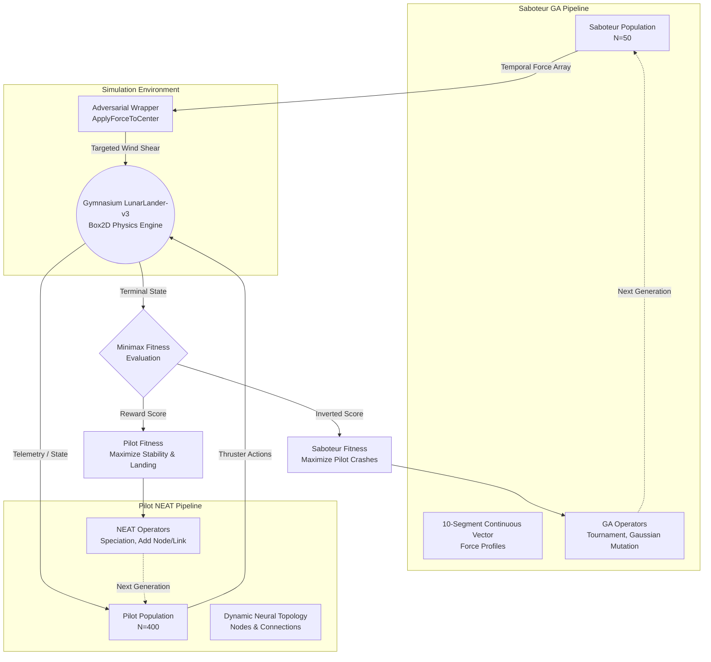

# Adversarial Neuroevolution: Co-Evolutionary Arms Race in Lunar Lander


## Overview
This repository contains the source code and research data for **Adversarial Neuroevolution**, a competitive co-evolutionary framework designed to address the fragility of autonomous control systems. 

Standard autonomous agents often "memorize" static training environments, making them incredibly brittle to out-of-distribution real-world noise (e.g., unpredictable wind shear). To solve this, this project implements a **zero-sum minimax game** within the `LunarLander-v3` Gymnasium environment. 

A primary flight controller (the **Pilot**) is evolved using NEAT (NeuroEvolution of Augmenting Topologies), while a secondary Genetic Algorithm (the **Saboteur**) is co-evolved simultaneously to act as an intelligent wind-shear, discovering specific temporal vulnerabilities to crash the Pilot.

## Project Structure
The codebase is fully modularized into core components and a three-phase training pipeline:

* **`saboteur.py`**: Contains the class definition, mutation, and crossover logic for the adversarial array.
* **`evaluate.py`**: The testing hub. Handles validation scoring, precision metrics, and video recording.
* **`visualize.py`**: The graphics hub. Handles Pygame HUDs, real-time neural network drawing, and matplotlib graph generation.
* **`train_pilot.py`**: Executes **Phase 1** (Baseline static training).
* **`train_saboteur.py`**: Executes **Phase 2** (Adversary training).
* **`train_adversarial.py`**: Executes **Phase 3** (The Co-evolutionary Arms Race).

## System Architecture




## Key Features
* **Dual-Engine Co-Evolution**: Runs two separate evolutionary algorithms in parallel. The Saboteur evolves to find weaknesses; the Pilot evolves to patch them.
* **Physics Injection Wrapper**: A custom gymnasium wrapper that directly overrides the Box2D physics engine, injecting the Saboteur's evolved continous-force vectors (```ApplyForceToCenter```) during flight.
* **Topological Optimization (NEAT)**: The Pilot doesn't just learn weights; it evolves its own neural network structure, starting from zero hidden nodes to prevent "neural bloat."
* **Automated AI Red-Teaming**: Eliminates the need for human-coded edge cases by automating the discover of system failures.

## Execution Pipeline (Usage)
To replicate the experiment, you must run the training scripts in chronological order. Each script features a command-line interface for training, testing, and plotting.

### Phase 1: Baseline Pilot Training
Train a standard NEAT controller in a zero-wind environment.
```
python train_pilot.py train
python train_pilot.py test_best
```

### Phase 2: Saboteur Evolution
Freeze the Champion Pilot's brain and evolve the Saboteur GA to discover its physical vulnerabilities.
```
python train_saboteur.py train
python train_saboteur.py test
```

### Phase 3: Adversarial Hardening (Co-Evolution)
Force the Pilot population to evolve defensive strategies against the Saboteur's attack profile.
```
python train_adversarial.py train
python train_adversarial.py test_best
```

### Analytics & Validation
You can generate data plots and vlaidate the success rate of the models at any time by passing different arguments to the training scripts.
```
# Generate matplotlib graphs of the evolutionary progress
python train_adversarial.py plots

# Run 50 headless simulations to get statistical success/crash rates
python train_adversarial.py validate

# Render a playback of the evolutionary milestones
python train_adversarial.py playback
```

## Results & Findings
Through the co-evolutionary arms race, the system yielded several profound insights into robust control:

1. **The Resilience Gap**: The baseline Pilot (trained in a vacuum) had a **12% survival rate** when introduced to severe turbulence. After adversarial hardening, the new Pilot achieved an **89% survival rate**.
2. **The Stability Tax**: Robustness comes at a cost. The hardened Pilot experienced a **19.3% reduction in peak fuel efficiency** compared to the baseline model, choosing to "counter-steer" and prioritize safe defensive postures over high-speed efficiency.
3. **Emergent Tactical Behavior (The Landing Flare Trap)**: The Saboteur GA discovered a highly lethal stategy&mdash;withholding all lateral force during the initial descent and unleashing a maximum 25.00N force exclusively during the final 50 steps of the simulation maximizing the chance of a fatal tip-over when the Pilot is lowest on fuel.
4. **Topological Efficiency**: Both the fragile baseline Pilot and the highly robust Adversarial Pilot converged on an identical, minimal neural architecture of exactly **13 nodes**. This proves that resilience in this domain is achieved through highly optimized weight configurations (counter-steering), not through topological bloat.

## Installation & Setup

**Prerequisites**
* Python 3.10+
* Gymnasium (with Box2D)
* NEAT-Python
* Pygame (for visualization)

**Installation**
1. Clone the repository:
```
git clone https://github.com/jwmathis/lunar_adversary.git
cd lunar_adversary
```
2. Install the required dependencies:
```
pip install -r requirements.txt
```
## Project Origins
This project was developed by John Wesley Mathis for SSE 674: Introduction to Genetic Algorithms at Mercer University.
